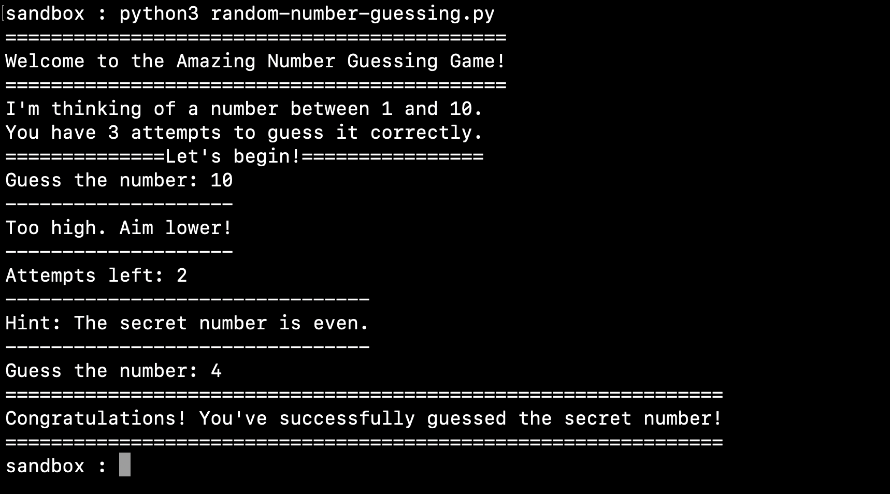

# Random Number Guessing Game in Python

Welcome to the Amazing Number Guessing Game! This user manual will guide you through the game mechanics and provide helpful tips for a successful gameplay experience. Additionally, we would like to introduce you to our [Python homework help service](https://domyprogramminghomework.io/python-homework-help/) offered by [Domyprogramminghomework.io](Domyprogramminghomework.io). If you need expert assistance with your Python assignments, don't hesitate to reach out to us at team@domyprogramminghomework.io.

## Objective:
The objective of the game is to guess the secret number chosen by the computer. The secret number is a whole number between 1 and 10, inclusive.

## Gameplay:

The game will generate a secret number for you to guess.
You have 3 attempts to guess the secret number correctly.
Enter your guess by typing the desired number and pressing Enter.
If your guess is correct, you win the game! Congratulations!
If your guess is incorrect, the game will provide feedback to help you adjust your next guess.
Each time you make a guess, the game will inform you if your guess is too high or too low.
Pay attention to the hints provided to make more informed guesses and increase your chances of winning.
After each guess, the game will display the number of attempts remaining.
If you run out of attempts without guessing the correct number, the game ends and reveals the secret number.
## Tips and Hints:

Try to narrow down your guesses by paying attention to whether the secret number is even or odd. The game will provide a hint about this after your first unsuccessful attempt.
Avoid repeating the same guess, as the game will inform you if you've already guessed a number.
Keep track of the feedback and adjust your subsequent guesses accordingly to increase your chances of success.
Python Homework Help by Domyprogramminghomework.io:
Are you struggling with your Python programming assignments? Our team at Domyprogramminghomework.io is here to assist you! We offer professional Python homework help tailored to your specific requirements. Whether you're stuck with coding concepts, debugging, or need assistance with complex algorithms, our expert Python programmers are ready to lend a hand.

To avail our Python homework help service, simply send us an email at team@domyprogramminghomework.io with your assignment details and any specific requirements. Our friendly support team will promptly assist you and provide you with a fair quote for our services. With our expertise and timely delivery, you can confidently submit your Python assignments and achieve academic success.

Don't let Python programming challenges hold you back. Let [Domyprogramminghomework.io](https://domyprogramminghomework.io) be your trusted partner in mastering Python. Reach out to us today and experience the difference!
